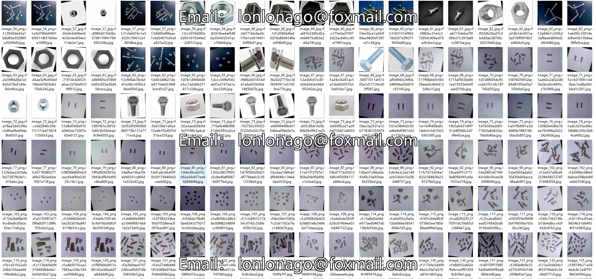
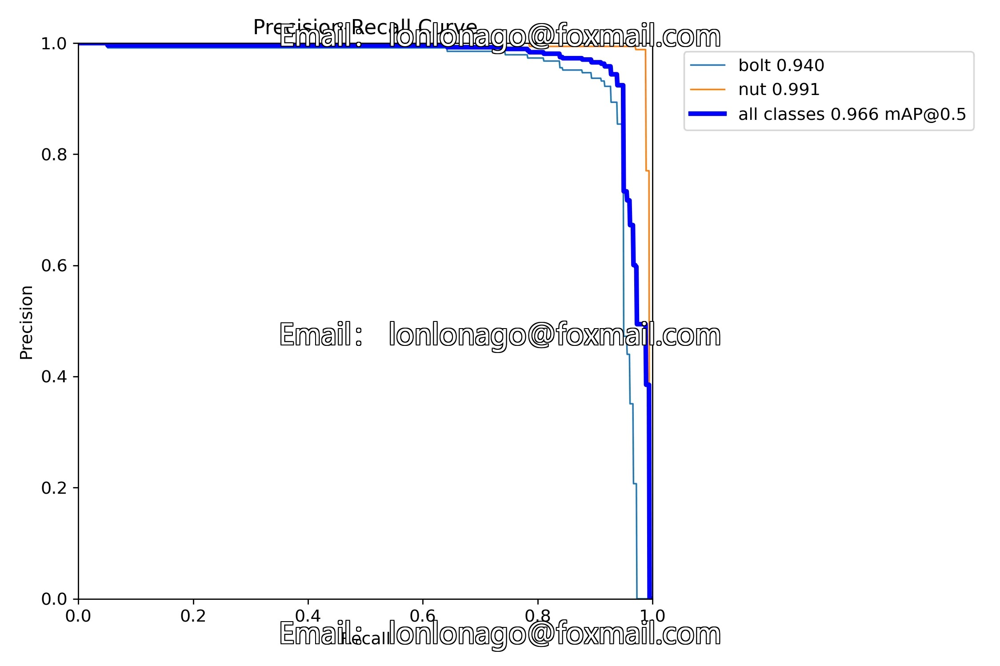
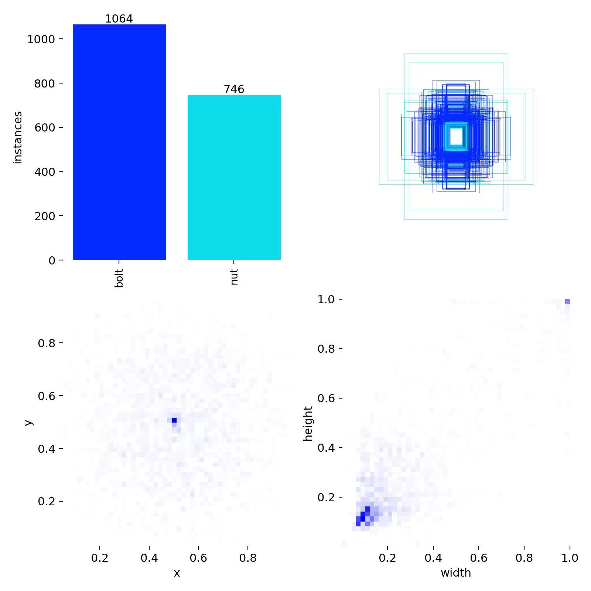
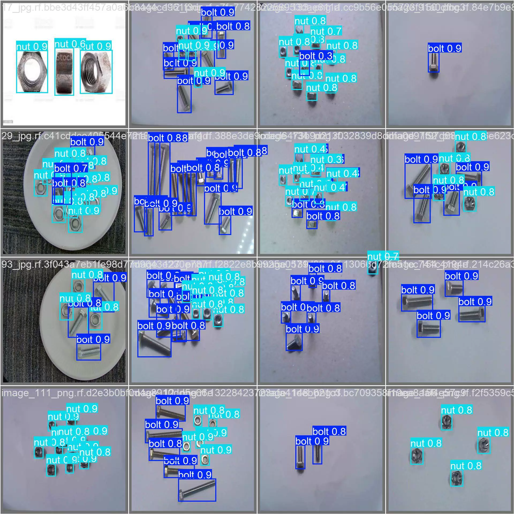
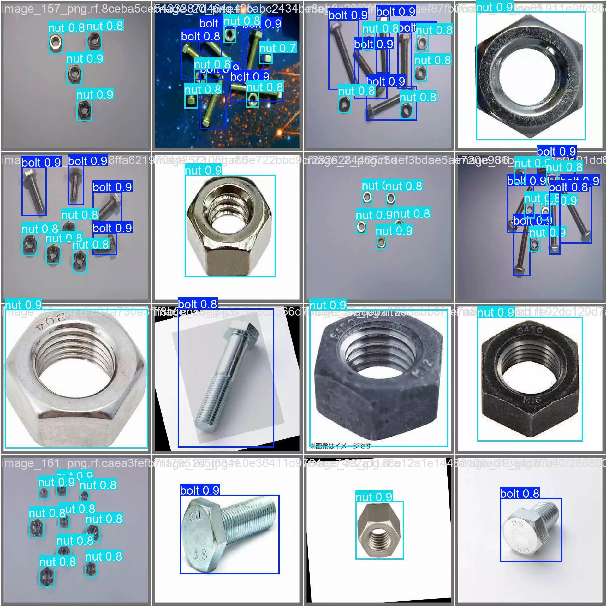
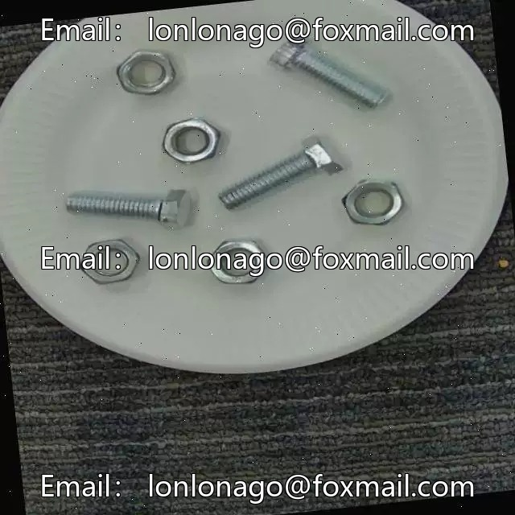
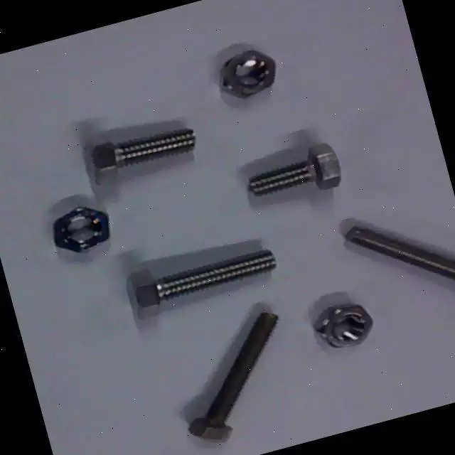

## Body

Bolt Nut Detection Dataset in YOLO format

Total of 550 images, labeled and divided into training set (396), test set (82), validation set (72)

Divided into two categories: 'bolt' and 'nut', bolts and nuts

Contains the YOLOv8s weight file (100 training rounds, pre-trained model YOLOv8s.pt, mAP@0.5=0.966) with the training result files

Electronic virtual products are not returnable after sale.

## Images

item_1061084114859

Here is a pay link on Stripe ( https://buy.stripe.com/3cs8yP7sY87d0vu9AB ). Please contact me lonlonago@foxmail.com after funding $89, and I will send you a complete data files , thank you!

